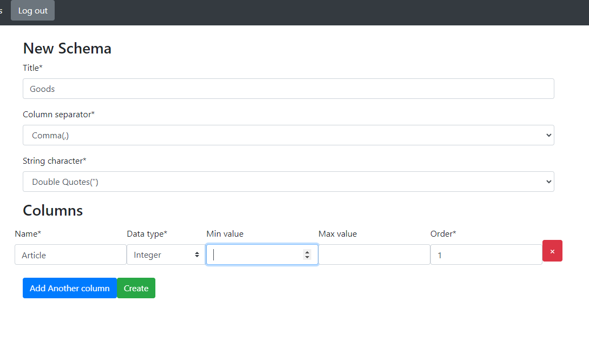
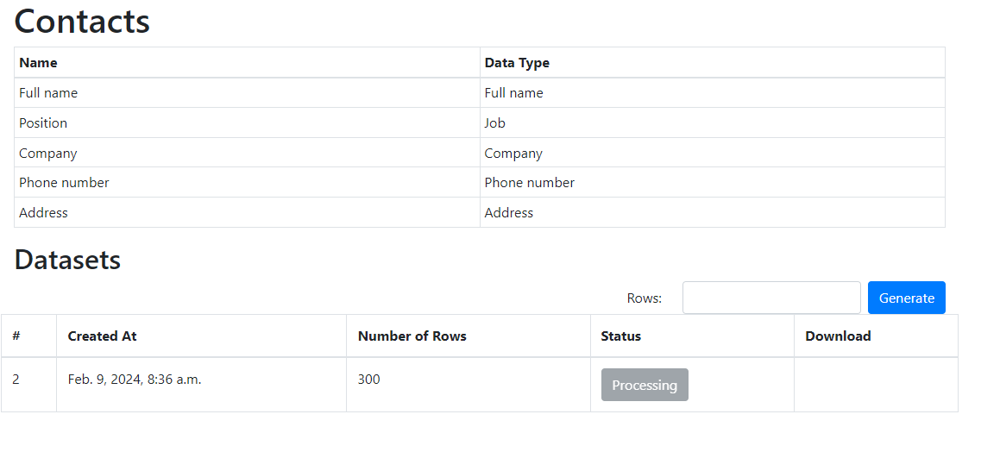
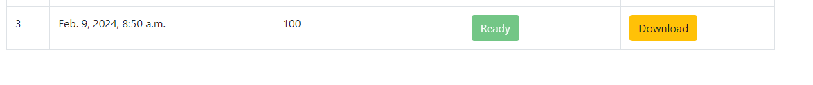

# Dataset Generator Web Application

## Description
This web application allows users to register, create dataset schemas, generate datasets based on these schemas with any number of rows, and download them in CSV format. Users receive email notifications once their datasets are ready.

## Features
- User registration: Users can create accounts to access the application.
- Dataset schema creation: Users can define the structure of their datasets by creating schemas.
- Dataset generation: Users can generate datasets based on their schemas with custom row counts.
- CSV download: Generated datasets can be downloaded in CSV format.
- Email notifications: Users receive email notifications when their datasets are ready for download.

## Installation
# Running a project with Docker
To run the project locally, follow these steps:

1. Clone the forked repo
    ```
    git clone https://github.com/vshvanska/csv-fake-data-generator.git
    ```
2. Open the project folder in your IDE
3. Open a terminal in the project folder
4. Create .env file, inside define variables from .env.sample. 
(You mast generate app key for EMAIL_PASSWORD variable in you email account. 
This app will work without sending messages, if you don't do it.)
5. Run with docker
    ```
    docker-compose up --build
    ```

## Usage
1. Register or log in to the web application.
2. Create dataset schemas by defining the columns and their types.

3. Generate datasets based on these schemas, specifying the desired number of rows.

4. Wait for the email notification indicating that the dataset is ready.
5. Download the generated dataset in CSV format.


## Technologies Used
- Django
- Celery
- PostgreSQL
- Redis
- Faker
- HTML/CSS/Bootstrap/Email
- csv-writer (for generating CSV files)